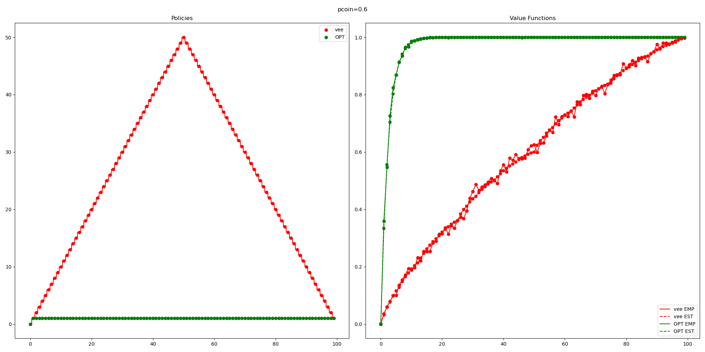
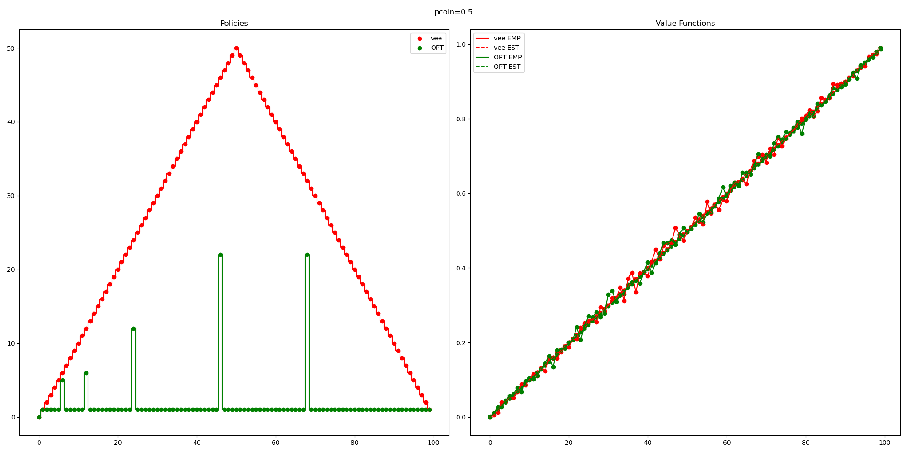
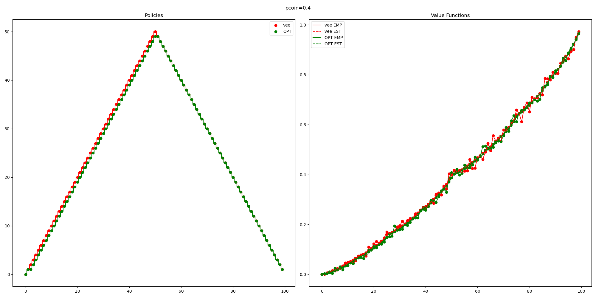

As per plan dictated in [[live research options]] (and fortunately also because I'm feeling intellectually interested) I am devoting some resources to learning about ML. In this post I'll explain the basics of RL. Will start with a bunch of definitions.

**Ref: Sutton Barto RL textbook** 
# part 1
This book has two parts:
- Part 1: tabular methods
- Part 2: approximate solution methods
## chapter 1: intro
Tabular methods is for when the state space is relatively small (e.g., can fit reasonably in memory). o/w need approx methods.
## Chapter 2: bandits

$k$-armed bandits is arguably the simplest possible setting for RL: there's just one state. 
Various flavors of the problem, e.g., stationary/non-stationary arm rewards.

To make it an interesting problem let's say you don't know the rewards. 

A simple strategy: the $\varepsilon$-greedy strategy explores random arm with Pr $\varepsilon$, o/w it greedily chooses the best arm. 
## Chapter 3: defining a MDP and some notations 

- **RL**: a suite of methods for approximately solving the Bellman Equation
- **MDP:** States, actions, and transition rules. Specifically, p(new state, reward | old state, action).
	  - NB: this should obey the markov property: the transitions just depend on your current state and action, not your state two moves ago.
	  - If the transitions do depend on information from the past, then your state should include that info too. E.g., your state might need to be all the moves that have ever happened. This is generally probably pretty unfortunate though. 
- **Our goal**: optimize the time-discounted reward $\sum_{t\ge 0} \gamma^t R_t$
	- "Episodic" --> you eventually reach a terminal state and that just get 0 reward forever after.
	- "continuing" --> no time limit. Then, it's usually a good idea to have $\gamma < 1$ and $\sup_{t\ge 0}R_t <\infty$.
- **Policy**: $\pi(a \mid s)$: probability distribution over actions given the state
- $v_\pi(s)  = \sum_{a} \pi(a\mid s) \sum_{s',r} p(s',r\mid s, a) (r+\gamma v_\pi(s'))$: value of a state, with respect to a policy. This is your expected reward if you employ strategy pi starting at state s.
- $q_\pi(s,a) = \sum_{s',r}p(s',r\mid s,a)(r+\gamma v_\pi(s')).$ This is sometimes called q-function or action-value function.
- **optimal policy:**  A policy that maximizes v_pi(s) for all states s
	Note: It's useful to think of policies as partially ordered by their value functions.
	In particular, we say that a policy dominates another policy if it has higher value function on every single state. It turns out that there is an optimal 
	policy (although not necc unique).
- By *math* it turns out that you can actually solve for the optimal policy.  Like you get a bunch of equations and stuff. 

**But there's a catch! Actually, there are three separate catches.** 
1. Uncertainty about transitions.
2. Too computationally expensive. 
3. "Markov Property"
   (If you're pedantic this is not really a thing. We're interested in solving MDP's. By definition they have the markov property. But ykwim.)

---

## chapter 4: DP
Usually too expensive but very foundational; other stuff is just trying to approx this. 

> Q1: Given a policy $\pi$ how to compute $v_\pi$?

- In principal, if you knew all the transitions then you could invert some huge matrix. 
- But, maybe that matrix is kind of big. 
- And you have bigger problems if the transitions are unknown.
- So here's an iterative method that converges to the correct answer:

$$
v_{k+1}(s) = \sum_a \pi(a\mid s) \sum_{s',r} p(s',r\mid s,a)[r+\gamma v_k(s')].
$$
Base conditions is put value zero at all terminal nodes. 

An interesting optimization that they propose is using the  newly computed values for $v_{k}$  as soon as they're available. Apparently this is still rigorous. And it's pretty easy to see how this could vastly accelerate convergence. E.g., propagation in a path could happen in like 1 round rather than n rounds.   


> [!tip] The Policy Improvement Theorem
> Suppose $\pi,\pi'$ are deterministic policies satisfying $q_\pi(s, \pi'(s))\ge v_\pi(s)$ for all $s$. Then $v_{\pi'}(s) \ge v_{\pi}(s)$ for all $s$. (i.e., $\pi'$ is at least as good as $\pi$).

So I guess this gives you an algorithm for improving a suboptimal policy: 
- Choose a local place where modifying the strategy is obviously a good idea, and then do that local modification.
- Ok apparently you can actually do this simultaneously in parallel at all vertices and that is still legit. Yup this makes sense. Like the whole idea is that the new strategies made by these local updates DOMINATE the old strategies. They're better at every single freaking state. So it's not an issue to do this update in parallel. 

> Alek: "oh there's no way that doesn't just get stuck in a local optima really easily. I guess you can explore starting from a variety of different places..."\
> JJ: "nope lol if policy improvement doesn't work then you have found a 'fixed/stable point' which is guaranteed to be the optimal policy".\
> Alek: dang that's pretty op
> JJ: Yeah, it turns out it gets even better. This process of repeatedly evaluating a policy (computing value functions) and then doing policy improvement with those is guaranteed to converge in a finite number of steps if your MDP stuff is finite, because it has to be a strict improvement until it starts becoming equality which is when you're optimal.

Another note: 
Something that is usually done to speed this up is to just interleave the policy evaluation and policy improvement steps. 
I.e., you don't need to wait for perfect policy evaluation before doing the policy improvement stuff. Apparently this works p well.

Now, I'll work through one of the exercises. I think the optimal policy here is pretty non-obvious, but my little RL mouse could smell the cheese and just went for it. 

```python
"""
Problem description:

Gambler has some money 0<X<100. 
At each round, gambler can bet any amount of money <= X. 
- Reward of +1 for winning the game.
- Reward of 0 for everything else. 
No time discounting or whatever, let's just maximize sum_{t\ge 0} R_t

Although I might play around with some stuff like 
"""

import matplotlib.pyplot as plt
from random import random as rand
N = 100
# the state space is range(N)
# specifically, all terminal states (e.g., >= $10 or <= $0) are represeted by 0.
# besides this, i represents having $i
pcoin = .6 # pr[heads]
gamma = 1

"""
a couple of helper functions for queries about the state
"""
def terminal(capital):
    return capital <= 0 or capital >= N

def terminal_reward(capital):
    return capital >= N

def new_capital(capital, pi):
    stake = pi[capital]
    if rand() < pcoin:
        return min(capital+stake, N)
    else:
        return max(0, capital-stake)

"""
some helper function for propagating values
"""
def propagate_value(capital, stake, val):
    # win stake
    new_capital = min(N, capital+stake)
    r = new_capital == N
    winval = r + gamma * val[new_capital%N]

    # lose stake
    new_capital = max(0, capital-stake)
    r = 0
    loseval = r + gamma * val[new_capital%N]

    return pcoin*winval + (1-pcoin)*loseval

"""
Iterative procedure for updating values.
NB: it's guaranteed to converge to the correct value, and strictly increase until then.
"""
def update_values(val,pi,nsteps):
    for step in range(nsteps):
        for capital in range(1,N):
            val[capital] = propagate_value(capital, pi[capital], val)
    return val

def find_optimal_policy():
    # Note: Doing a couple of searches from random starting locations would be
    # smarter. But this method is guaranteed to converge and the state
    # space is small enough that this should be chill.
    pi = [1 for i in range(N)] 
    val = [0 for i in range(N)]

    NROUNDS = 1000
    VALUE_STEPS = 10

    for round in range(NROUNDS):
        # estimate the new value
        val = update_values(val, pi, VALUE_STEPS)

        # update the policy to be the greedy policy based on the current value function
        # this is guaranteed to be a better policy 
        # (assuming that we had a decent estimation of the value function) 
        for capital in range(1,N):
            best_stake = 1; best_val = 0
            for stake in range(1, capital):
                alternate_val = propagate_value(capital, stake, val)
                if alternate_val > best_val:
                    best_stake = stake
                    best_val = alternate_val
            pi[capital] = best_stake

    pi[0]=0
    return pi


"""
***************
PLOTTING STUFF
***************
"""


"""
estimate the value of a policy by just running the policy a bunch of times
"""
def empirical_value(pi, TRIALS=1000):
    v_estimate = [0 for i in range(N)]
    for trial in range(TRIALS):
        for i in range(N):
            capital = i
            while not terminal(capital):
                capital = new_capital(capital, pi)
            v_estimate[i] += terminal_reward(capital)
    for i in range(N):
        v_estimate[i] /= TRIALS
    return v_estimate

def estimated_value(pi):
    return update_values([0 for i in range(N)], pi,1000)

def plot_policy(policy,col,name):
    plt.step(range(N),policy,where='mid',c=col)
    plt.scatter(range(N),policy,label=name,c=col)

def plot_value(value,label,col,ls):
    #  plt.step(range(N),value,label=label,where='mid')
    plt.scatter(range(N),value,c=col,ls=ls)
    plt.plot(range(N),value,label=label,c=col,ls=ls)

# Define policies
pi_opt = find_optimal_policy()
pi_all_in = [i for i in range(N)]
pi_silly = [1 for i in range(N)]
pi_vee = [i if i <= N//2 else N-i for i in range(N)]

print("PIOPT", pi_opt)

# PLOT
COLORS = ["r", "g", "b","c"]
POLICIES = [pi_vee, pi_opt]
NAMES = ["vee", "OPT"]

fig, axes = plt.subplots(nrows=1, ncols=2, figsize=(20, 10))

# Plot policies in the first subplot
for pi, col, name in zip(POLICIES, COLORS, NAMES):
    plt.sca(axes[0])  # Set the current axis to the first subplot
    plot_policy(pi,col,name)

axes[0].legend()
axes[0].set_title("Policies")

# Plot value functions in the second subplot
for pi, col, name in zip(POLICIES, COLORS, NAMES):
    plt.sca(axes[1])  # Set the current axis to the second subplot
    plot_value(empirical_value(pi), name + " EMP", col, '-')
    plot_value(estimated_value(pi), name + " EST", col, '--')

axes[1].legend()
axes[1].set_title("Value Functions")

fig.suptitle(f"pcoin={pcoin}")
plt.tight_layout()
plt.show()

```

> chatgpt being sassy: 
> "The function name `propogate_value` should be `propagate_value` (correct spelling) unless you intentionally named it this way."




So you might be concerned about the fact that the curve labelled "OPT", trained by my RL agent isn't consistently outperforming this random baseline that I came up with. 
So I think I accidentally came up with a pretty reasonable baseline (for the case $p<.5$ at least).
I'm pretty happy that my RL agent at least approximately converges to this. 
So maybe there is some minor bug in my code preventing us from actually getting optimal...
I'll take a look sometime, but for now going to forge ahead. 
Honestly it's also possible that OPT looks suboptimal, but this is simply an artifact of how I'm estimating the value functions.
Believing this will at the very least help me sleep at night.

Note that if I wanted to check this it wouldn't be too hard. This is a small enough MDP that I can explicitly compute (by inverting some matrix) the value function.

**asynchronous DP**
You don't need to update in a fixed order. 
- The most common application of this is you learn while playing
- This is the whole "play against yourself / other agents" idea
 - basically the reason why this is more computationally tractable is that you are exploring a much smaller portion of the state space, namely the states that tend to show up in a game (for example).
## chapter 5: monte carlo

In this chapter we don't assume knowledge of how the transitions work. 
We will just learn from experience. 

For some reason not yet clear to me we are only going to look at rewards after a complete episode. I mean, this is fine. E.g., this models playing a game (reward of +1 for winning).

A simple way of estimating the value function (for a policy): experience it and then average.
- first-visit monte carlo: you play the game and observe the time discounted cumulative reward that you got. You then average these.
- every-visit monte carlo: same but every time

You can show that both of these converge to the right thing apparently. 

Note MC method doesn't do any bootstrapping (i.e., updating value function at a state based on value function at other states). We will come up with some other method later that does bootstrap I'd guess. 

Now, imagine that you knew $v_*$. This doesn't actually give you a **policy**! If you don't know how the transitions work. 
So I guess in this case we'd rather know $q_*$.

As a warm up, let's now talk about how to estimate $q_\pi$.
Ok, it's just the same thing as before, you average over your experiences. 

Concern:
Many state-action pairs won't be explored. Like, you'll only be able to compute $q_\pi(s, \pi(s))$ (assuming a deterministic strategy).
How do we encourage exploration?
- "exploring starts"
- just use a stochastic policy that assigns some non-zero probability to each action at each state. 
- This is just the same as bandit. 
- e.g., literally just do $\varepsilon$-greedy
- I really advocate for decreasing $\varepsilon$ over time probably though, unless you suspect some kind of non-stationarity

**Off policy prediction via importance sampling**
- there are some reasons to think that maybe the $\varepsilon$-greedy strategy is pretty bad
- one reason is that over the course of a long game, you're going to have some of these random moves triggered, and it could be the case that an agent that occasionally makes random moves does EXTREMELY poorly.
- Anyways, so now we're going to have two policies: the **target policy** that we're learning about and trying to build, and the **behavior policy** which is how we actually generate data.
- on-policy methods are simpler, but have these drawbacks discussed above. 
- off-policy is way more powerful
	- e.g., it lets you learn from human experts

OK, so Q1
> prediction. Let's suppose you want to evaluate policy $\pi$ (i.e., learn $q_\pi$), but all you have access to is some data from behavior policy $b$. What can you do?

I mean so first we can give impossibility results. You can't do any estimation stuff here unless you have $b(a\mid s)>0$ whenever $\pi(a\mid s)>0$.
So yeah the behavior thing needs to be exploratory.

**Importance sampling**:
Define 
$$\rho(S_{1},A_{1},S_{2},A_{2},\ldots)= \prod\frac{\pi(A_k\mid S_k)}{b(A_k\mid S_k)}.$$
It turns out (you do Bayes rule and some stuff cancels out) that this is the ratio of the probabilities of the trajectory under the bx policy and the target policy.

The problem with off-policy learning is that it doesn't really make sense to average rewards along a trajectory. 
You should normalize by the importance-sampling ratio.

There are two approaches now.
$$
V(s) = \frac{\sum_{t\in T(s)} \rho_{t:T(t)-1} G_t}{|T(s)|}
$$
$$
V(s) = \frac{\sum_{t\in T(s)} \rho_{t:T(t)-1} G_t}{\sum_{t\in T(s)}\rho_{t:T(t)-1}}
$$
Formula (1) is unbiased but has crummy variance.
Formula (2) is biased, but the bias converges to zero, and its variance is much better. 

There are some other methods for obtaining even better estimates. By which I mean lower variance. Apparently this is a big deal. I won't go into it right now though.
## chapter 6 temporal-difference learning
Apparently this is a big deal. We're going to combine DP + monte carlo
sum buzz words: q-learning, sarsa, TD.
Hopefully by the end of this chapter I will understand what these things are. 

ok, here's a comparison.

Note that throughout the literature, $G_t$ is used to denote the **generalized-return** or **global-return** or **goal** or **gain** or whatever mnemonic you can come up with for $\sum_{t>0} \gamma ^{t} R_t$. 
Ok, actually I've realized that the reason that "G" is used for this is because it sounds like "积" which is how you say accumulate in Chinese. Apparently chatgpt doesn't believe me, but whatever.

| method      | How we estimate $v_\pi(s)$                                                                                                                                                                                                                                                                                                                                                        |
| ----------- | --------------------------------------------------------------------------------------------------------------------------------------------------------------------------------------------------------------------------------------------------------------------------------------------------------------------------------------------------------------------------------- |
| Monte Carlo | Sample a trajectory average the empirical gains $G_t$.<br>Mathematically you could say this is $\mathbb{E}[G_t\mid S_t=s]$                                                                                                                                                                                                                                                        |
| DP          | Bootstrap using tabular estimates $V_\pi$ of the value function at neighboring states.<br><br>mathematically this looks like $\sum_{s',r} p(s',r\mid s,\pi(s))[r + \gamma V_\pi(s')].$                                                                                                                                                                                            |
| TD(0)       | Mash DP and monte carlo together. <br>More formally, we look empirically at what state we transitioned to and what reward we got, but then we bootstrap the value function from the neighbor that we sampled. So it would look like $r+\gamma V_\pi(s')$<br><br>NB you just incrementally update towards this value, like you have a learning rate $\alpha$ and update like this. |
|             |                                                                                                                                                                                                                                                                                                                                                                                   |

Why is TD(0) good?
- Well it's nice that we don't need to know the transition rules (We can just learn from experience).
	- As a corollary of this, I'd say TD(0) is probably pretty not necessary if you do understand the transition rules.
- Bootstrapping is just a good idea. Monte Carlo is silly for not bootstrapping / needing to wait until the end of an episode to get a reward.

TD(0) is guaranteed to converge "if stuff is sufficiently nice" which it probably is.
Empirically is much better than Monte Carlo.

> Q: how to handle off-policy learning? 
> A: importance sampling ratio.

**SARSA: an on-policy TD control method**
We're going to think about $q$ instead of $v$. fine.

$$
Q(S_t, A_t) \gets Q(S_t, A_t) + \alpha [R_{t+1}+\gamma Q(S_{t+1},A_{t+1})-Q(S_t,A_t)].
$$
**Q-learning: off-policy TD control!**

$$
Q(S_t, A_t) \gets Q(S_t,A_t) + \alpha [R_{t+1}+\gamma \max_a Q(S_{t+1},a)-Q(S_t,A_t)].
$$

OK, so this is actually kind of insane: 
> **"The learned action-value function $Q$ directly approximates $q_*$, *regardless* of the policy being followed."**

(Except, ofc your policy needs to have non-zero probability of exploring all trajectories. And there are some other technical assumptions to guarantee convergence. But anyways.)

So, does this make sense? Yeah I think so. 

**Expected Sarsa**:
- Instead of taking one move and then bootstrapping, take all the moves.
- This reduces the variance a bit at the expense of being somewhat more expensive to compute.

**Maximization Bias and Double Learning**
Here's a problem:
Suppose you have two options: A = quit,  B = go to a new state, where you have a large number of actions available, and they each have $\mu=-.1,\sigma=1$.
You might mistakenly start to think that B is a good idea because we are taking a max somewhere. 

A solution is to learn $Q_{1}$ and $Q_{2}$ and then you can take an argmax on one of the Q's and evaluate it's value using the other Q to get an unbiased estimate. Apparently this does good things sometimes.

**some optimizations to q learning stuff**

"afterstates":
suppose you are playing tic-tac-toe. 
Suppose state, action pairs $(s_{1},a_1)$ and  $(s_{2},a_{2})$ result in the same final board configuration and the same reward. Then these should have the same state-action pairs should have the same value. With conventional q-learning we'd store these in two separate places. It'd be smarter not to. 

## chapter 7: n step bootstrapping

## chapter 8: xxx
# PART 2

**Idea**: when the state space is too huge we need to **approximate** functions (e.g., value function), rather than actually compute it.
We will have some values for the value function, e.g., by playing the game a few times, and then we need to generalize to other states that we've never seen before. 

This is now exactly a **supervised learning problem!** Neat. 
I mean, there are some complications like non-stationarity, delayed targets, need to bootstrap.
But we'll deal with it.
## chapter 9 on-policy prediction with approximation

Objective: 
minimize mean squared value error, which is defined  as
$$
VE(w) = \sum_s \mu(s) [v_\pi(s) - \hat{v}(s,w)]^{2}.
$$
Where $\mu(s)$ is the fraction of time spent at state $s$.
We have some function $\hat{v}(s,w)$ that takes in a state $s$ and some weights, then it somehow  magically combines these into an approximation of $v_\pi(s)$.

Note:
- Earlier in the book lots of things had provable guarantees. Very comforting to me with my theoretician hat on. 
- Now however we're doing highly non-convex optimization. So yeah good luck getting provable guarantees about obtaining global optima. Gradient descent is just a fancy way of randomly walking around in space. But sure we can get some local optima. And if you start in enough random places and have enough exploration then this is fine.

**stochastic-gradient and semi-gradient methods**
$$
w_{t+1}= w_t - \frac{1}{2} \alpha \nabla [v_\pi(S_t)-\hat{v}(S_t,w_t)]^{2}.
$$
$$
w_{t+1}= w_t + \alpha [v_\pi(S_t)-\hat{v}(S_t,w_t)] \nabla \hat{v}(S_t,w_t).
$$
There's some weird subtleties that happen because we don't actually know $v_\pi$, we just have estimates of it. I'm not following yet, doesn't seem too important.

**Features**
- You might need to think a bit about what features are relevant. 
- but if you're a deep model then probably can learn p well from raw sensory input

- linear models are super nice
- if you're not actually linear then we can probably just add some more features and make you be linear (e.g., adding $x^{2},yx, y^{2}$ terms).

Ok, I guess we're just going to talk about some random methods for making up features now. Fine.

You could have a bunch of circles that cover your state space, and then have the feature vector be an indicator for whether you are contained in each of these circles. 
ok sure why not. 

you could also do tiling. 
Like you have a bunch of kind of overlapping grids. 

The motivation for having pretty coarse grids but then having some overlap is that you can generalize more, but still get good perf at a single point. 

It's probably a good idea to randomly offset your tilings rather than just have them have some fixed offset.


So I think basically the moral of the story is
- If you don't have the money to make a super deep model then you can probably engineer features and save a bunch on compute
- but still my impression is if you wanna learn some ridiculous function then if you throw a big enough model and enough compute at it then this can just work.
- But I appreciate the cute hacks at engineering features. 

ok a fun hack. 
hash a bunch of features to a single location to save space. 
- maybe the model can learn superposition
- but even more likely not many of those states were super important. 
lol

sometimes people use Radial Basis functions, which is a continuous generalization of the tiling techniques just discussed. But they don't seem to perform substantially better. so probably not worth the extra cost.

they go on a long rant about regularization. I guess you should use dropout.

**to be continued: the rest of this chapter**
# part 0: some experiments
I'm going to try to build an "amnesiac maze solver". 
The idea is, we have an agent, and it gets some environmental input from sensory data. 
The agent is living in a maze and it wants to get out. (i.e., I give it a -1 point penalty for every time step that it stays in the maze).I'm going to try to build an "amnesiac maze solver". 
The idea is, we have an agent, and it gets some environmental input from sensory data. 
The agent is living in a maze and it wants to get out. (i.e., I give it a -1 point penalty for every time step that it stays in the maze).

So obviously this is NON-Markovian. That's kind of weird. hmm. 
But I think this is maybe workable. 

Like, what would $v_\pi(s)$ mean in this scenario?

The way I'd think about it is, 
- randomly sample a maze from some distribution
- randomly sample a starting position in the maze from some distribution
- Suppose that you follow policy $\pi$ starting from this position in the maze. what's your expected return?
- I can't quite tell if this is reasonable. But I'm interested in trying it out.

So obviously this is NON-Markovian. That's kind of weird. hmm. 
But I think this is maybe workable. 

Like, what would $v_\pi(s)$ mean in this scenario?

The way I'd think about it is, 
- randomly sample a maze from some distribution
- randomly sample a starting position in the maze from some distribution
- Suppose that you follow policy $\pi$ starting from this position in the maze. what's your expected return?
- I can't quite tell if this is reasonable. But I'm interested in trying it out.

ok, I was about to try this out but I think I can prove impossibility results.
Like, I think you're just not really supposed to do things like this. 

ok, so fine. what if we augment the state by also passing in some kind of history. 
now the problem is at least in principle solvable and I guess it's Markovian. 

But it also means we're in the realm where it feels like we need some way of obtaining a compressed approximate description of the state space?
or more formally where we just want to approximate the value function.

## part 0.1 Mountain Car

ok so I've decided against implementing the maze thing described above at least for now. 
Instead I want to try implementing Mountain Car. 
This is a classic RL exercise I think. 

The basic premise is, you have a car on a mountain which has some position and velocity at each point in time (this is the sate). 
The possible actions are accelerate right, accelerate left, and don't accelerate.

The tricky thing is that we're going to assume that gravity is too strong for the car to get to the goal just by using gravity. 
It has to first go up the opposite hill, and then fall down that hill to gain a bunch of speed.